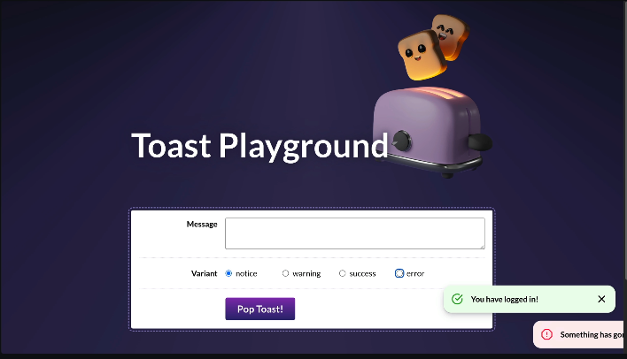

# Try-My-Toaster

This is a challenge project from Joshua Comeau's **Joy of React** course  
The challenge was to create a custom Toast component, which could  
be used to create notifications of different kinds.

All html structure, components, logic, react state management and scss styling made by myself.

## Design spec

## Features

Fully responsive design.  
Form creates toasters that animate in from right. Form resets on submission, without page reload.  
Custom Input component, which is highly customizeable, built with accessibility in mind.  
Toasts are accessible - read by screen reader, after current focus is finished reading. Toast variant type is also announced.  
Escape key dismisses all notifications. Toasts are otherwise focusable via button component.  
Toasts auto dismiss after 8 seconds.  
Context provider for toasters, so toasts can be accessed and rendered from different places.

## Credits

Toaster image, design by Joshua Comeau
